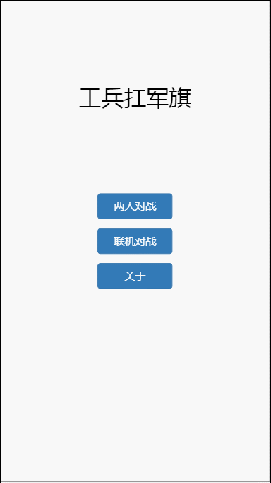

# 项目介绍
【工兵扛军旗】是我们几个小伙伴改良的一种玩法, 此种玩法以杀光对方所有棋子为目标,展开的攻防作战。 与主流的玩法存在一些不同点，如:除工兵、炸弹外的普通棋子只能一步一步的走， 特定棋子可以组合为棋子组，军旗被扛不再是胜负的条件，而是变成杀人的工具。

# 技术栈
 前端vue + socket.io  
   后台 nodejs + socket.io
# 在线demo
  [在线demo http://junqi.chengxg.site](http://junqi.chengxg.site)

# 项目gif截图
    

# 运行项目
## 安装依赖
npm install
## 测试开发
npm run dev  
输入localhost:3000即可访问
## 打包构建
npm run build  
编译后修改 static/css下css文件中的font-face路径，将static修改为“../”

# 玩法说明
## 【工兵扛军旗】玩法
> 简介： 此玩法为翻棋玩法， 地雷被 工兵挖上不会消失，反而被 工兵所用； 军旗被 工兵扛上游戏不会结束， 军旗变成了 工兵的杀人工具； 炸弹会被 排长俘获,变成自己阵营的棋子； 该玩法意在双方进行攻防厮杀,而非进行夺棋厮杀。

1. 军棋棋盘： 军棋棋盘包含铁路线、公路线，包括10个行营、46个兵站、4个大本营。在该玩法中,大本营等同于兵站。 兵站是棋子的摆放位置；铁路线是部分棋子的快行线，只要在直线上或弯路棋子走步数不限； 公路线是慢行线，每次只能移动一步； 行营是棋子的安全岛，在行营中的棋子可以免受其他任何棋子的攻击。

2.  棋子类型： 	
	普通棋子类型有； 司令, 军长, 师长, 旅长, 团长, 营长, 连长, 排长, 工兵, 地雷, 军旗 	
	组合棋子类型有； 工兵+地雷, 工兵+军旗, 工兵+地雷+军旗, 排长+炸弹， 其中（ 地雷, 军旗, 炸弹均为对方棋子）。	

3. 	杀棋规则：	
	普通棋子大小： 司令> 军长> 师长> 旅长> 团长> 营长> 连长> 排长> 工兵 地雷和 军旗不能移动， 炸弹可以移动,但是不能进入行营， 炸弹可以炸掉除 排长之外的棋子； 相同的棋子相遇后同时消失。 工兵遇到对方的 地雷或 军旗，将变成组合棋子 工兵+地雷或 工兵+军旗或 工兵+地雷+军旗。 排长遇到对方的 炸弹变成组合棋子 排长+炸弹。	
	组合棋子大小： 工兵+地雷可以炸掉比 工兵大的单个棋子同时扔掉一个 地雷， 工兵+军旗可以杀掉比 工兵大的单个棋子， 排长+炸弹的威力与 炸弹相同。 工兵+地雷、 炸弹、 排长+炸弹可以炸掉己方的 地雷、 军旗，让对方的 工兵无 地雷可挖， 军旗可扛，由此 工兵、 地雷、 军旗、 排长、 炸弹成为了双方关注的焦点。	

4. 行棋规则： 工兵 及工兵的组合棋子可以在铁路线上在没有阻挡的情况下任意行棋； 炸弹 在铁路线上走直线,其余棋子在铁路线上每次只能移动一步(和公路线上一样)； 所有棋子在公路线上只能移动一步。

5. 阵营选择： 游戏开始时首先翻开的棋子的颜色为该玩家的阵营，然后双方进行厮杀。

6. 胜负规则： 杀光对方的棋子或对方无棋可走（军旗被扛不会输奥），方可胜利。 玩家超时5次或断开网络链接90s自动判负。

7. 玩法说明： 游戏开始时，系统随机指定一人为先手，玩家轮流进行翻棋或行棋， 轮到自己行棋时，点击自己的棋子即可选择，然后点击目的位置即可完成行棋。 左右滑动组合棋子可查看该组合棋子的棋子组成，在移动组合棋子时也可选择部分棋子进行移动。 一方的行棋时间最长为30s，超时则由另一方进行行棋。
